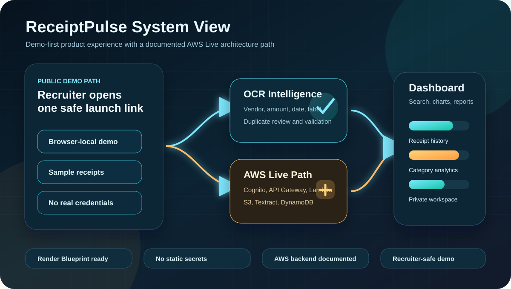
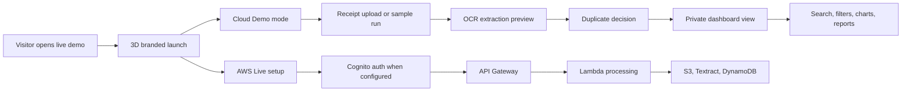
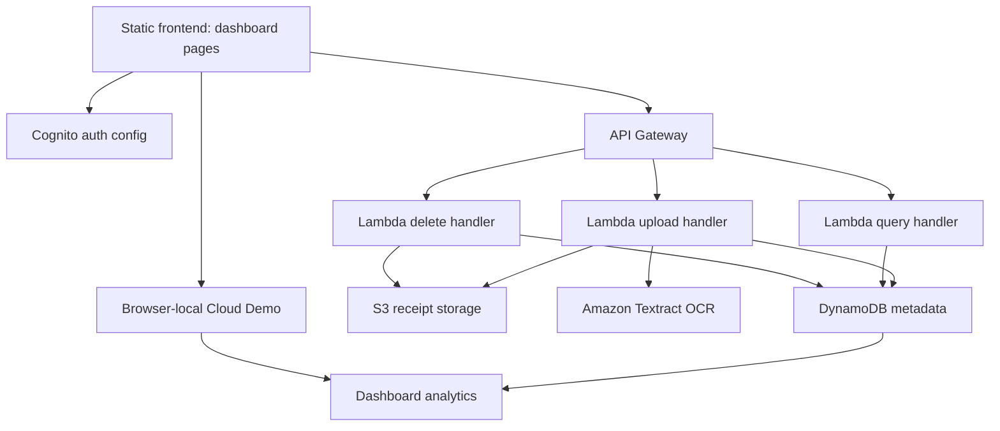
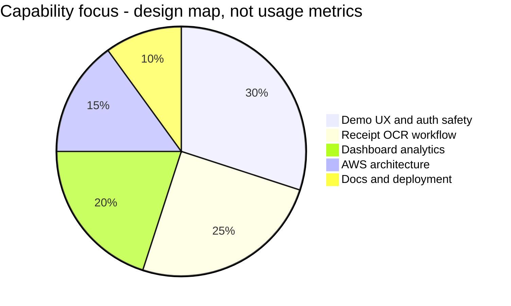
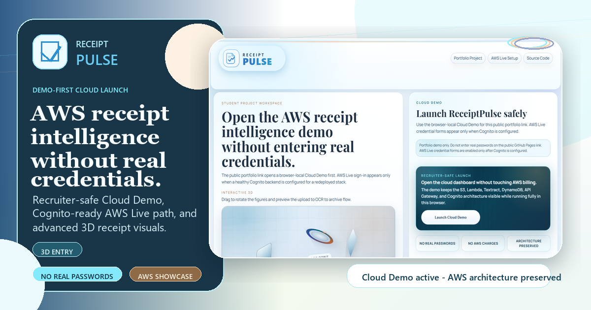

<div align="center">
  

  # ReceiptPulse

  <strong>Demo-first AWS receipt intelligence for upload, OCR extraction, duplicate review, and spend analytics.</strong>

  <p>
    <a href="https://receiptpulse-cloud-demo.onrender.com/"><strong>Open Live Demo</strong></a>
    &nbsp;|&nbsp;
    <a href="https://github.com/agarwalujala3-lang/ReceiptPulse"><strong>Source Code</strong></a>
    &nbsp;|&nbsp;
    <a href="#deploy-on-render"><strong>Deploy on Render</strong></a>
  </p>

  
  
  
  
  
</div>

<br />

<p align="center">
  
</p>

## Executive Snapshot

ReceiptPulse is a recruiter-ready cloud portfolio project that presents a complete receipt-processing product flow: users can enter a safe public demo, review sample uploads, inspect OCR-style extraction, handle duplicates, search receipt history, and explore analytics dashboards without exposing real credentials or cloud secrets.

The public build is intentionally **demo-first**. That keeps the project accessible while the AWS Live path remains documented and reconnectable through configuration for Cognito, API Gateway, Lambda, S3, DynamoDB, and Textract.

## Why It Stands Out

| Signal | What reviewers see |
| --- | --- |
| Product thinking | A full journey from launch page to dashboard, reports, profile, receipt history, and analytics. |
| Cloud architecture | Clear AWS serverless path with API, OCR, storage, metadata, and auth responsibilities separated. |
| Demo safety | Public users can explore without passwords, billing risk, or private receipt data. |
| Frontend polish | High-contrast visual system, 3D entry motion, dashboard cards, readable charts, and responsive pages. |
| Recruiter clarity | The README and UI explain what is live, what is simulated, and how the production path connects. |
| Deployment maturity | Netlify live demo plus Render Blueprint configuration with security headers and route rewrites. |

<p align="center">
  
</p>

## Public Demo Vs AWS Live

| Mode | Purpose | Current behavior |
| --- | --- | --- |
| Cloud Demo | Recruiter-safe public preview | Runs in the browser with local/sample data and no real credentials. |
| AWS Live | Real backend architecture path | Connects when `dashboard/config.js` contains working Cognito/API configuration. |
| Render Deploy | Alternative public hosting path | `render.yaml` is included for static hosting, headers, and clean routes. |
| Netlify Deploy | Current live demo host | Publishes the `dashboard/` folder as the canonical public demo. |

## Product Journey



## Architecture



## Capability Graph



## Feature Matrix

| Feature | Demo mode | AWS Live path |
| --- | --- | --- |
| Safe public launch | Yes | Yes |
| Receipt/bill upload UI | Yes | Yes |
| OCR-style extracted fields | Yes, sample/local | Yes, via Textract path |
| Vendor, amount, date, labels | Yes | Yes |
| Duplicate receipt decision | Yes | Yes |
| Search and filters | Yes | Yes |
| Category charts and reports | Yes | Yes |
| Per-user workspace | Demo identity | Cognito-backed identity |
| Storage and metadata | Browser-local sample data | S3 and DynamoDB |
| API processing | Simulated/local fallback | API Gateway and Lambda |

## Visual System

| Layer | Direction |
| --- | --- |
| Brand mood | Deep navy, graphite, cyan, teal, and warm amber for a cloud-console feel. |
| Entry pages | 3D receipt visuals, staged launch motion, clear demo-first messaging, and high-contrast controls. |
| Dashboard | Command-center layout with spending cards, receipt history, charts, reports, and review states. |
| Accessibility | Stronger contrast, reduced-motion support, responsive stacking, and readable form states. |
| Trust | Mode labels show whether the user is in Cloud Demo or AWS Live setup. |

<p align="center">
  
</p>

## Security And Demo Safety

| Control | Why it matters |
| --- | --- |
| Demo-first public flow | Recruiters can test the app without creating credentials. |
| No static AWS secrets | The frontend does not store private AWS keys. |
| Config-driven live mode | Real auth/API only appear when backend settings exist. |
| Local sample data | Public demos avoid private receipts, phone numbers, addresses, or billing data. |
| Strict static headers | Render Blueprint includes frame, content type, referrer, permissions, and CSP protections. |
| Clear AWS boundary | The README separates the public demo from the production AWS deployment path. |

## Repository Map

```text
dashboard/
  index.html                 Public demo/auth launch page
  signup.html                AWS Live setup entry
  app.html                   Main dashboard shell
  profile.html               Profile workspace page
  reports.html               Reports and analytics page
  app.js                     Receipt state, demo data, analytics, duplicate flow
  auth.js                    Auth and demo-mode state handling
  auth-3d.js                 Auth page 3D visuals
  entry-3d.js                Launch page 3D motion layer
  brand-launch.js            Entry experience interactions
  multipage.js               Shared page navigation behavior
  styles.css                 Main visual system
  config.js                  Runtime API/auth configuration
  data/demo-dashboard.json   Safe demo dataset

docs/
  deployment.md              Deployment notes
  aws-account-redeploy.md    AWS recovery and redeploy plan
  readme-system-graph.svg    README system visual

branding/
  receiptpulse-ai-hero.png   AI-generated README hero artwork
  portfolio-brand-mark.svg   Brand mark

render.yaml                  Render Static Site Blueprint
template.yaml                AWS SAM/serverless infrastructure template
netlify.toml                 Current Netlify static deployment config
```

## Run Locally

This project can run as a static frontend without installing Node dependencies.

```bash
cd dashboard
python -m http.server 4173
```

Open:

```text
http://localhost:4173/
```

Then choose **Cloud Demo** to explore the dashboard safely.

## Configure AWS Live Mode

`dashboard/config.js` controls whether the frontend connects to a live backend.

```js
window.RECEIPTPULSE_CONFIG = {
  apiBaseUrl: "https://YOUR_API_ID.execute-api.YOUR_REGION.amazonaws.com",
  demo: {
    enabled: true,
    autoFallback: true
  },
  auth: {
    hostedUiDomain: "YOUR_COGNITO_DOMAIN",
    clientId: "YOUR_COGNITO_CLIENT_ID",
    region: "ap-south-1",
    appPath: "./app.html"
  }
};
```

Keep secrets out of this file. Static frontend config can contain public endpoints and public Cognito client identifiers, not private keys.

## Deploy On Render

This repo already includes a Render Blueprint. Use **Blueprint** so headers and rewrites are applied automatically.

[Open Render Blueprint Deploy](https://dashboard.render.com/blueprint/new?repo=https://github.com/agarwalujala3-lang/ReceiptPulse)

Expected Render settings from `render.yaml`:

| Setting | Value |
| --- | --- |
| Service type | Static web service |
| Runtime | `static` |
| Branch | `main` |
| Build command | `echo "Publishing ReceiptPulse dashboard static assets"` |
| Publish path | `./dashboard` |
| Auto deploy | Enabled |
| Clean routes | `/app`, `/signup`, `/profile`, `/reports` |
| Headers | Security and cache headers included |

## Verification Checklist

Before sharing the project publicly, verify:

| Check | Expected result |
| --- | --- |
| Open `/` | Launch page appears with clear Cloud Demo messaging. |
| Click Cloud Demo | Dashboard opens without asking for real credentials. |
| Open `/app` | Render/Netlify rewrite serves `app.html`. |
| Open `/signup` | AWS Live setup page stays demo-safe and readable. |
| Upload/sample action | Demo data renders without backend errors. |
| Mobile viewport | Cards stack cleanly with no horizontal overflow. |
| Browser console | No missing asset or blocked script errors. |

## AI-Friendly Project Context

```yaml
project: ReceiptPulse
category: cloud portfolio and receipt intelligence demo
current_public_mode: browser-local Cloud Demo
aws_live_path: config-driven Cognito + API Gateway + Lambda + S3 + DynamoDB + Textract
frontend: HTML, CSS, JavaScript
hosting:
  current_demo: Netlify static site
  render_ready: render.yaml Blueprint included
security_posture:
  - no static AWS secrets
  - demo-first public access
  - local sample data for public reviewers
  - security headers for static deployment
reviewer_value:
  - product-style flow
  - cloud architecture clarity
  - OCR workflow storytelling
  - dashboard analytics
  - deployment resilience
```

## Recruiter Pitch

ReceiptPulse shows more than a static portfolio page. It demonstrates how a cloud product is designed, explained, deployed, and made safe for public review: a polished frontend, a demo-first auth strategy, OCR workflow storytelling, analytics screens, Render/Netlify deployment readiness, and a documented AWS serverless path for production rebuilds.
