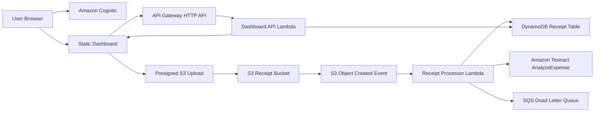

<div align="center">
  
  <h1>ReceiptPulse</h1>
  <p><strong>AWS serverless receipt intelligence platform with a recruiter-ready interactive dashboard.</strong></p>
  <p>Upload receipts, extract structured expense data, detect duplicates, review low-confidence results, and analyze spend through a polished cloud operations console.</p>

  <p>
    <a href="https://agarwalujala3-lang.github.io/ReceiptPulse/"><strong>Live GitHub Pages Demo</strong></a> |
    <a href="https://agarwalujala3-lang.github.io/ReceiptPulse/app.html?demo=1&sample=1"><strong>Instant Cloud Demo</strong></a> |
    <a href="#demo-and-live-modes">Demo Modes</a> |
    <a href="#architecture">Architecture</a> |
    <a href="#what-makes-it-stand-out">Highlights</a> |
    <a href="#run-locally">Run Locally</a> |
    <a href="#aws-redeploy">AWS Redeploy</a>
  </p>

  <p>
    <a href="https://github.com/agarwalujala3-lang/ReceiptPulse/actions/workflows/validate.yml">
      
    </a>
    
    
    
    
  </p>
</div>

---

## 30-Second Pitch

ReceiptPulse is a production-style AWS cloud project that turns receipt uploads into structured financial intelligence. The backend is built with AWS SAM, Lambda, S3, DynamoDB, API Gateway, Cognito, and Textract. The frontend is a premium static dashboard with a dynamic 3D entry sequence, interactive receipt pipeline visuals, local upload preview, charts, duplicate-review flows, and an explicit Cloud Demo mode for safe portfolio viewing when AWS is unavailable.

## Demo And Live Modes

| Mode | Purpose | Behavior |
| --- | --- | --- |
| GitHub Pages Live Demo | Public recruiter link | Publishes the static dashboard with Cloud Demo enabled and AWS calls disabled by default. |
| AWS Live | Real cloud deployment | Uses Cognito auth, API Gateway, Lambda, S3, DynamoDB, and Textract. |
| Cloud Demo | Recruiter-safe portfolio mode | Uses browser-local demo tokens and sample data. Uploads, rename, delete, and analytics update locally without calling AWS or creating charges. |
| Static Preview | No auth/API configured | Shows the interface and cloud architecture story with built-in sample data. |

The demo mode does not remove the AWS project meaning. It keeps the cloud architecture visible and makes the showcase usable while a previous AWS account is restricted or while a new AWS account is being prepared.

## What Makes It Stand Out

- **Cloud-first architecture:** event-driven receipt processing with S3 events, Lambda workers, DynamoDB indexes, API Gateway endpoints, and Cognito-scoped users.
- **AI extraction workflow:** Textract `AnalyzeExpense` normalizes vendor, date, total, confidence, category, and line-item style data.
- **Quality gates:** duplicate detection, missing-field review, confidence thresholds, and user decisions before records affect analytics.
- **Premium dashboard UI:** 3D brand entry animation, rotatable receipt figures, high-contrast professional theme, animated pipeline timeline, and polished recruiter-facing copy.
- **Demo-safe resilience:** the app remains interactive without AWS access by using local browser state and sample data.
- **AI/recruiter readable docs:** architecture, mode behavior, deployment, cost controls, and repo map are documented clearly.

## Architecture



## Core Product Flow

1. User signs in through Cognito or opens Cloud Demo mode.
2. User selects a PDF, JPG, JPEG, or PNG receipt.
3. Frontend previews the receipt and requests a secure upload session.
4. AWS Live uploads to S3; Cloud Demo mirrors the same stages locally.
5. Lambda and Textract extract receipt fields in AWS Live.
6. Review rules flag low-confidence or duplicate receipts.
7. Dashboard updates metrics, category charts, vendor charts, receipt archive, and history.
8. User can rename labels, delete receipts, or clear date ranges according to the active mode.

## Technical Stack

| Layer | Technology |
| --- | --- |
| Infrastructure | AWS SAM / CloudFormation |
| Auth | Amazon Cognito User Pools |
| Upload Storage | Amazon S3 presigned upload flow |
| Processing | AWS Lambda, EventBridge, SQS DLQ |
| OCR / AI | Amazon Textract `AnalyzeExpense` |
| Database | Amazon DynamoDB, on-demand billing, GSIs |
| API | Amazon API Gateway HTTP API |
| Frontend | Static HTML, CSS, modular vanilla JavaScript |
| Demo Fallback | Browser `sessionStorage` and `localStorage` |

## Repository Map

```text
dashboard/                 Static web app, animations, auth, demo mode, dashboard UI
lambda/                    Receipt processor, dashboard API, Cognito pre-signup trigger
template.yaml              AWS SAM infrastructure definition
dashboard/data/            Demo dashboard data for portfolio-safe mode
.github/workflows/         CI plus GitHub Pages static dashboard deployment
docs/deployment.md         Standard deployment guide
docs/aws-account-redeploy.md  New-account redeploy and billing safety guide
tests/                     Python test coverage for processor behavior
sample-receipts/           Local receipt samples for manual testing
```

## Live Static Demo

The safe public demo is designed for GitHub Pages:

```text
https://agarwalujala3-lang.github.io/ReceiptPulse/
https://agarwalujala3-lang.github.io/ReceiptPulse/app.html?demo=1&sample=1
```

The Pages workflow publishes `dashboard/` and writes a deployment-only `config.js` with `apiBaseUrl` empty, Cognito empty, and Cloud Demo enabled. That means the public link stays interactive without touching the restricted AWS account.

## Run Locally

From the repository root:

```bash
python -m http.server 4177 -d dashboard --bind 127.0.0.1
```

Open:

```text
http://127.0.0.1:4177/index.html
```

Use **View Cloud Demo** on the sign-in page to open the dashboard without AWS access. Direct QA/share links also work: `http://127.0.0.1:4177/app.html?demo=1` opens Cloud Demo, and `http://127.0.0.1:4177/app.html?demo=1&sample=1` opens Cloud Demo and auto-runs one sample receipt.

## AWS Redeploy

Use this when moving the project to a clean AWS account or a new region.

```bash
sam build
sam deploy --guided
```

After deployment, update `dashboard/config.js` or hosting environment variables with:

```text
apiBaseUrl
Cognito hosted UI domain
Cognito user pool client id
redirectSignIn
redirectSignOut
```

See [docs/aws-account-redeploy.md](docs/aws-account-redeploy.md) for the safe migration checklist, billing guardrails, and old-account limitations.

## Cost Controls Before Any New AWS Deploy

- Enable MFA on the root user.
- Create an AWS Budget with email alerts at small thresholds before deploying.
- Keep DynamoDB on on-demand billing for tiny demo traffic.
- Keep Lambda memory and timeout conservative.
- Use sample receipts only during testing.
- Watch Textract usage because OCR calls can cost money outside free-tier limits.
- Delete test stacks with `sam delete` when finished.
- Do not create a new AWS account to avoid an old unpaid balance; treat it as a clean redeploy target only.

## Verification Commands

```bash
python -m pytest
node --check dashboard/app.js
node --check dashboard/auth.js
node --check dashboard/entry-3d.js
node --check dashboard/multipage.js
node --check dashboard/auth-3d.js
```

## Status

ReceiptPulse is cloud-ready and demo-safe. If the original AWS account is restricted, the frontend remains usable through Cloud Demo mode while the backend can be redeployed from this repository into a new AWS account when billing and account setup are under control.
