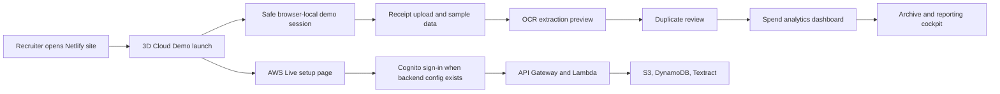
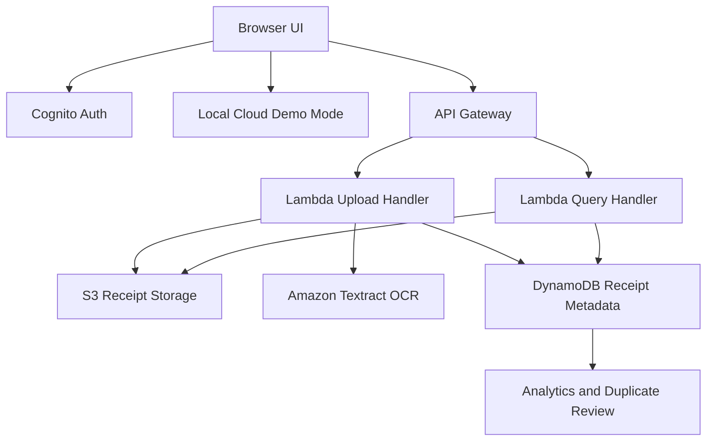

<div align="center">
  

  # ReceiptPulse

  <strong>AI receipt intelligence with a recruiter-ready Cloud Demo and AWS Live architecture path.</strong>

  [Live Site](https://receipt-pulse.netlify.app/) | [Instant Demo](https://receipt-pulse.netlify.app/app.html?demo=1&sample=1) | [Source Code](https://github.com/agarwalujala3-lang/ReceiptPulse)

  
  
  
  
</div>


## Executive Snapshot

ReceiptPulse is a polished cloud project showcase for receipt upload, OCR extraction, duplicate review, spend analytics, and archive intelligence. The public Netlify launch opens in a safe browser-local Cloud Demo so recruiters can experience the product instantly, while the AWS Live path remains documented for Cognito, API Gateway, Lambda, S3, DynamoDB, and Textract deployment.

The frontend has been rebuilt around a premium command-center visual language: dynamic 3D entry surfaces, glass panels, luminous pipeline objects, high-contrast charts, pointer-reactive motion, staged reveals, and a dark professional theme designed to stay readable instead of fading into the background.

## Live Demo

| Entry | Link | Purpose |
| --- | --- | --- |
| Public launch | https://receipt-pulse.netlify.app/ | Recruiter-safe landing page with Cloud Demo first. |
| Instant dashboard | https://receipt-pulse.netlify.app/app.html?demo=1&sample=1 | Opens the analytics cockpit with sample receipts. |
| AWS Live setup | https://receipt-pulse.netlify.app/signup.html | Shows the production auth path when a healthy backend is configured. |
| Source | https://github.com/agarwalujala3-lang/ReceiptPulse | Full project code, docs, and deployment history. |

## What Makes It Stand Out

| Area | Implementation |
| --- | --- |
| Demo-first auth | Public users enter a safe local demo without exposing passwords or cloud secrets. |
| AWS-ready backend | The same UI can connect to Cognito, API Gateway, Lambda, S3, DynamoDB, and Textract. |
| 3D launch experience | Entry pages include interactive 3D receipt objects, orbit systems, and pointer-reactive lighting. |
| Analytics cockpit | The dashboard highlights spend signals, processing state, duplicate decisions, and archive health. |
| Recruiter clarity | Copy explains what is simulated, what is cloud-ready, and what architecture is demonstrated. |
| Security posture | Demo mode avoids credential capture, hides AWS auth fields until configured, and keeps secrets out of static files. |

## Product Flow



## AWS Architecture



## Frontend Relaunch System

The current UI uses a custom high-end visual layer instead of generic templates.

| Layer | Details |
| --- | --- |
| Brand surface | Deep navy graphite base, cyan/amber signal colors, glass panels, luminous edges. |
| Typography | Space Grotesk for hero and cockpit headings, Manrope for product copy, IBM Plex Mono for technical labels. |
| Motion | Page reveal staging, 3D panel tilt, orbital animation, pointer-driven light bloom, and reduced-motion safeguards. |
| Dashboard graphics | Command visual, pipeline nodes, advanced chart contrast, activity cards, and high-visibility metric panels. |
| Entry pages | Sign-in and AWS setup share the same premium launch styling and consistent Cloud Demo messaging. |

## Security And Demo Safety

| Control | Purpose |
| --- | --- |
| Demo-first launch | Public users can explore without entering real credentials. |
| Conditional auth state | Credential fields are only presented when the AWS auth configuration is available. |
| No frontend secrets | Static files do not store AWS secret keys or private credentials. |
| Safe sample data | Demo data is local and portfolio-safe. |
| Clear mode labels | The UI distinguishes Cloud Demo from AWS Live mode to avoid misleading reviewers. |

## Repository Map

```text
dashboard/
  index.html          Public launch and sign-in entry
  signup.html         AWS Live setup entry
  app.html            ReceiptPulse command center
  styles.css          Full visual system and relaunch animations
  luxe-ui.js          Pointer-reactive relaunch interactions
  auth.js             Demo/auth state handling
  app.js              Dashboard, receipts, analytics, duplicate flow
  config.js           Runtime API configuration placeholder

docs/
  deployment.md       Netlify and deployment notes
  aws-account-redeploy.md
                       AWS recovery and redeploy guidance

template.yaml         Serverless AWS infrastructure template
```

## Run Locally

This project is a static frontend plus optional AWS serverless backend.

```bash
cd dashboard
python -m http.server 4173
```

Open the local site:

```text
http://localhost:4173/
http://localhost:4173/app.html?demo=1&sample=1
```

## Configure AWS Live Mode

Create or update `dashboard/config.js` with the API endpoint for a deployed AWS backend.

```js
window.RECEIPTPULSE_CONFIG = {
  apiBaseUrl: "https://YOUR_API_ID.execute-api.YOUR_REGION.amazonaws.com",
};
```

AWS Live mode expects the deployed stack to provide the required Cognito and API behavior. If the backend is not available, the public site should continue to present Cloud Demo mode first.

## Deploy

The current public host is Netlify.

```text
https://receipt-pulse.netlify.app/
```

Typical static deploy target:

```text
dashboard/
```

Netlify should publish the contents of `dashboard/` so `index.html`, `app.html`, `signup.html`, assets, and scripts are served together.

## Verification Checklist

Before a public update, check these flows:

| Check | Expected result |
| --- | --- |
| Open `/` | Premium 3D launch page appears with Cloud Demo messaging. |
| Click Cloud Demo | Dashboard opens without requiring real credentials. |
| Open `/app.html?demo=1&sample=1` | Sample receipts and analytics render. |
| Open `/signup.html` | AWS Live setup page keeps the same branding and clear mode language. |
| Mobile viewport | Layout stacks cleanly with no horizontal overflow. |
| Reduced motion | Core content remains usable without animation dependency. |

## AI-Friendly Context

```yaml
project: ReceiptPulse
category: serverless cloud portfolio project
public_host: Netlify
primary_demo: browser-local Cloud Demo
aws_services:
  - Cognito
  - API Gateway
  - Lambda
  - S3
  - DynamoDB
  - Textract
frontend:
  - HTML
  - CSS
  - JavaScript
key_strengths:
  - recruiter-safe demo path
  - AWS-ready architecture
  - interactive 3D auth launch
  - analytics dashboard
  - duplicate receipt review
  - no frontend secrets
```

## Recruiter Pitch

ReceiptPulse demonstrates product thinking, frontend polish, cloud architecture, and security-aware demo design in one project. The public experience works immediately on Netlify, while the codebase still documents the AWS Live path for a full serverless deployment.
